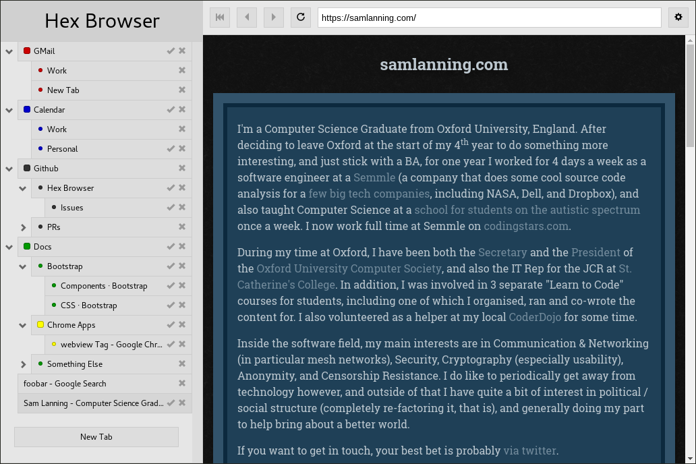

  

# Leaf Browser Alpha

This project is an **experimental** browser UI that runs as a Google Chrome app
and uses webview tags. It's in its **very early** stages at the moment.

## Key Features

* A tree structure for managing your tabs (that you can choose to hide).
* No distinction between bookmarks and tabs.
* Ability to rename tabs.
* Ability to "pin" tabs to prevent accidentally navigating away / closing.
* Not all tabs need to be loaded at once (they are loaded when you want them to
  be, and marked with a tick. You can also unload tabs to free up memory
  without fully closing them).
* Ability to colour-code tabs.

## Immidiate TODOs

* Allow closing of tabs with subtabs (pick between close / keep children)

## Roadmap

* Settings Screen.
* Ability to move tabs around.
* Touch-Screen friendly interactivity for managing tabs.
* Allow creation of different users, and switching users for particular tabs.
  (This could for example allow you to log in to certain sites with different
  users at the same time).
* Syncing tabs accross computers.
* Plugin architecture.

## Installation

You can install from the [chrome web store](https://chrome.google.com/webstore/detail/leaf-browser-alpha/nefehiekhccmedmdoilmhikhdiiijkbe).

You can also install it like so:

1. Make sure you have Google Chrome or Chromium installed.
2. Install `npm` and `grunt`.
2. Checkout this repository.
3. run `npm install && grunt`
4. In Chrome / Chromium, visit `chrome://extensions/`, enable "Developer Mode",
   Press "Load Unpacked Extension...", and select the directory checked out this
   repository.

You can now launch the app by visiting your Apps page (left hand side of the
bookmarks bar, or visit `chrome://apps/`), and selecting "Leaf Browser"

## Contribution

Contributions / PRs are of course welcome, but you need to be happy that your
code will be released under any license I fancy, as project owner.

## License

The MIT License (MIT)

Copyright (c) 2016 Sam Lanning

Permission is hereby granted, free of charge, to any person obtaining a copy of this software and associated documentation files (the "Software"), to deal in the Software without restriction, including without limitation the rights to use, copy, modify, merge, publish, distribute, sublicense, and/or sell copies of the Software, and to permit persons to whom the Software is furnished to do so, subject to the following conditions:

The above copyright notice and this permission notice shall be included in all copies or substantial portions of the Software.

THE SOFTWARE IS PROVIDED "AS IS", WITHOUT WARRANTY OF ANY KIND, EXPRESS OR IMPLIED, INCLUDING BUT NOT LIMITED TO THE WARRANTIES OF MERCHANTABILITY, FITNESS FOR A PARTICULAR PURPOSE AND NONINFRINGEMENT. IN NO EVENT SHALL THE AUTHORS OR COPYRIGHT HOLDERS BE LIABLE FOR ANY CLAIM, DAMAGES OR OTHER LIABILITY, WHETHER IN AN ACTION OF CONTRACT, TORT OR OTHERWISE, ARISING FROM, OUT OF OR IN CONNECTION WITH THE SOFTWARE OR THE USE OR OTHER DEALINGS IN THE SOFTWARE.
